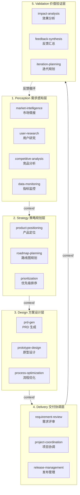
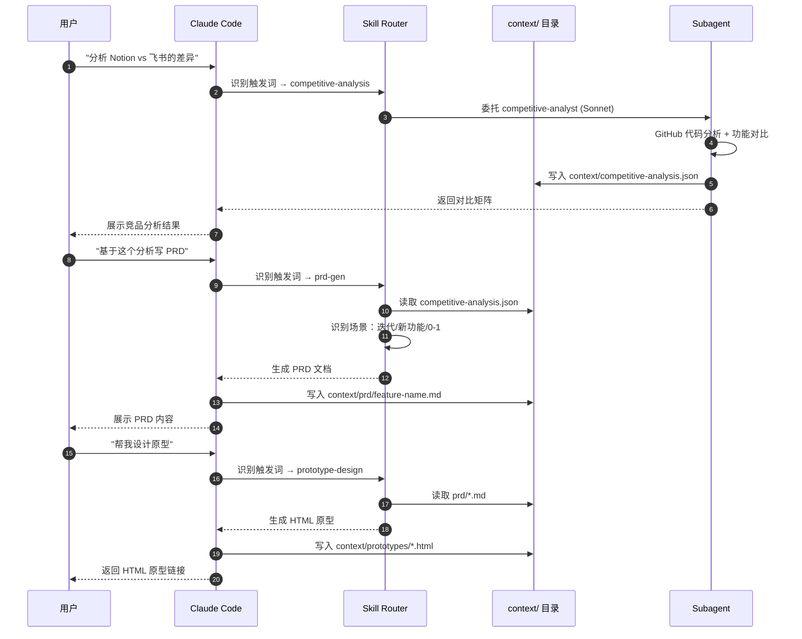
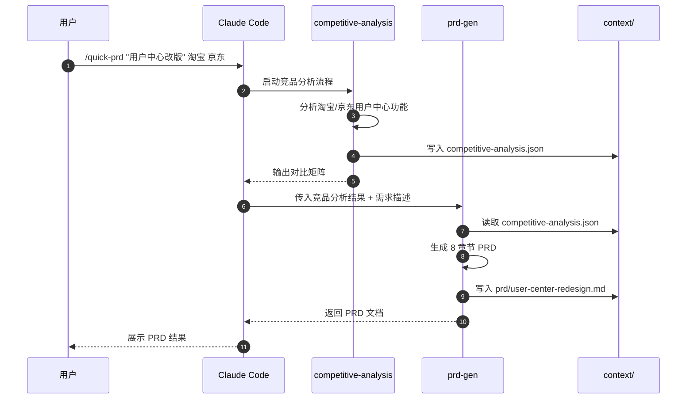
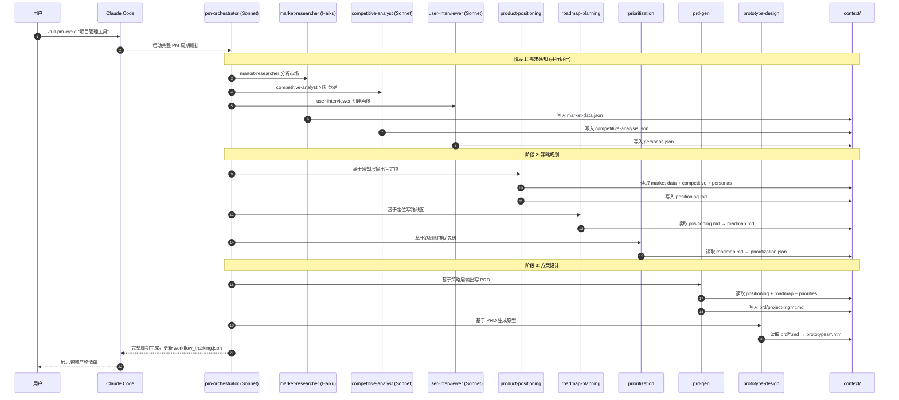
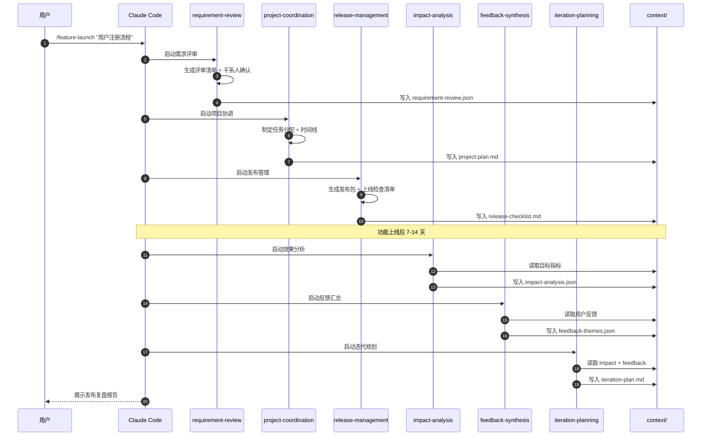
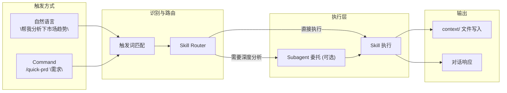
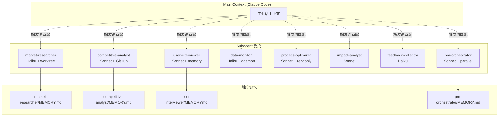
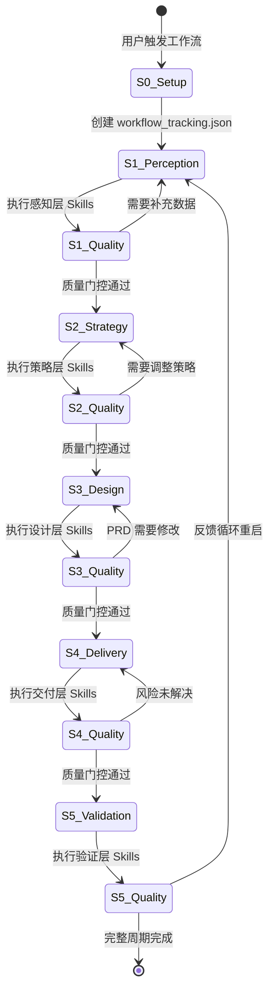
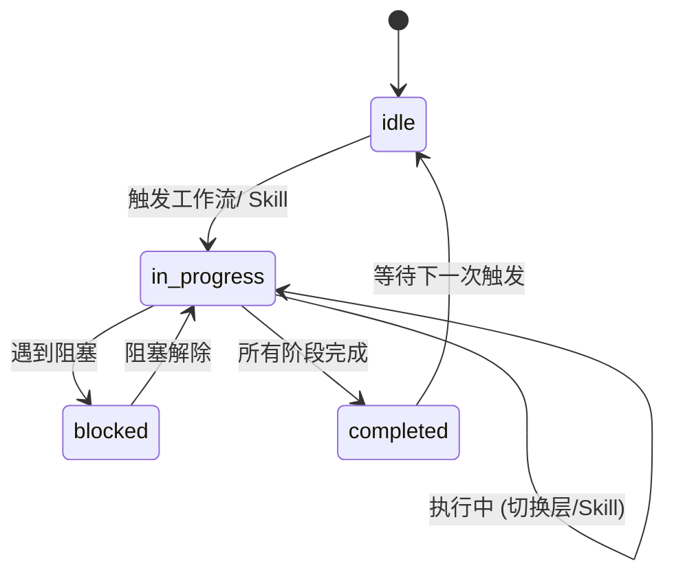

# Oh-My-PM 工作流架构 (v0.8.0)

Oh-My-PM 采用 **5 层架构** + **Plan-and-Execute 模式**，覆盖需求感知→策略规划→方案设计→交付协调→价值验证完整闭环。

## 5 层架构总览

## 用户对话流

用户通过 **自然语言** 或 **Command** 触发，系统自动识别并路由到对应 Skill。

## Command 工作流详解

### /quick-prd — 竞品分析 + PRD

### /full-pm-cycle — 完整产品管理周期

### /feature-launch — 功能发布工作流

## 独立 Skill 使用流程

每个 Skill 可独立使用，不依赖工作流。

## Subagent 委托架构

## Plan-and-Execute 模式

## 质量门控标准

### Perception 层

| 门控 | 标准 | 指标 |
|:-----|:-----|:-----|
| 市场研究完成 | 3+ 竞品市场规模和趋势分析 | `market_size`, `growth_rate`, `key_players` |
| 用户研究完成 | 3+ 用户访谈，2+ 用户画像 | `personas_created`, `interviews_conducted` |
| 竞品分析完成 | 2+ 竞品功能对比 | `competitors_analyzed`, `matrix_complete` |

### Strategy 层

| 门控 | 标准 | 指标 |
|:-----|:-----|:-----|
| 产品定位完成 | 定位声明 + 价值主张 + 差异化策略 | `positioning_created`, `value_proposition_clarity` |
| 路线图完成 | 12 个月产品路线图 | `milestones_defined`, `timeline_set` |
| 优先级完成 | RICE/MoSCoW 框架排序 | `rice_scores_calculated`, `moscow_decisions` |

### Design 层

| 门控 | 标准 | 指标 |
|:-----|:-----|:-----|
| PRD 完整 | 8 章节 PRD 文档 | `all_sections_complete`, `user_stories_mapped` |
| 原型验证 | 原型生成 + 可用性确认 | `prototype_created`, `design_consistent` |

### Delivery 层

| 门控 | 标准 | 指标 |
|:-----|:-----|:-----|
| 需求评审完成 | 干系人评审会议 + 签字 | `review_held`, `stakeholders_aligned` |
| 项目计划完成 | 任务分配 + 时间线确认 | `tasks_assigned`, `timeline_confirmed` |
| 发布准备完成 | 代码冻结 + 上线检查清单 | `code_freeze`, `checklist_complete` |

### Validation 层

| 门控 | 标准 | 指标 |
|:-----|:-----|:-----|
| 效果分析完成 | 上线 7-14 天目标达成分析 | `goals_achieved`, `variance_analyzed` |
| 反馈综合完成 | 用户反馈主题分析 | `themes_identified`, `improvements_mapped` |
| 迭代规划完成 | 下一轮迭代计划 | `next_iteration_planned`, `success_metrics_defined` |

## 状态机

## 版本历史

### v0.8.0
- 新增 Mermaid 可视化工作流架构
- 新增完整对话流 sequence diagram
- 定义 5 层架构 + Plan-and-Execute 模式状态机
- 补充 Subagent 委托架构图

### v0.7.0 (之前)
- 定义工作流阶段、状态机和统一质量门控
