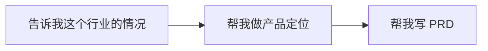
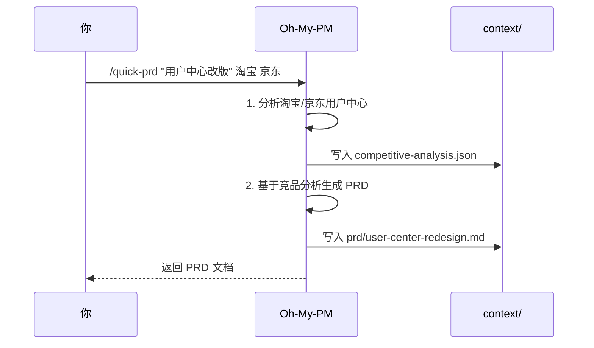
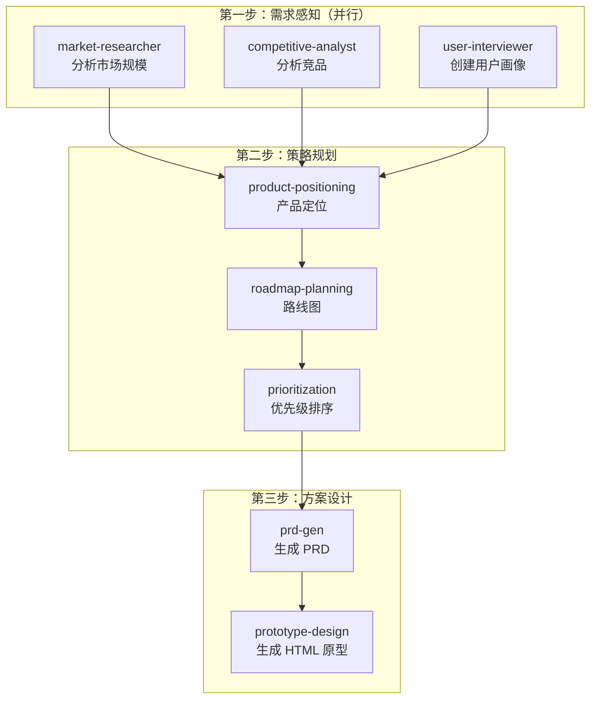

# Oh-My-PM 使用指南

面向产品经理的 Oh-My-PM 实操手册。

## 快速上手

### 安装

```bash
npx skills add kelegele/oh-my-pm -a claude-code
```

### 两种触发方式

| 方式 | 说明 | 示例 |
|:-----|:-----|:-----|
| **自然语言** | 直接对话，系统自动识别 | "帮我分析下 Notion 和飞书的差异" |
| **Command** | 斜杠命令直接调用 | `/quick-prd "需求描述" 竞品1 竞品2` |

---

## 使用场景导航

### 我刚接手一个产品

```
需求感知 → 策略规划 → 方案设计
```



1. **"分析一下 XX 行业的市场趋势"** → 自动调用 `market-intelligence`
2. **"帮我分析 Notion vs 飞书的差异"** → 自动调用 `competitive-analysis`
3. **"基于这些分析帮我做产品定位"** → 自动调用 `product-positioning`
4. **"帮我写一份 PRD"** → 自动调用 `prd-gen`

### 我要快速出一个需求文档

直接用 `/quick-prd` 命令：

```
/quick-prd "用户个人中心改版" 淘宝 京东
```

执行流程：



### 我要从 0 到 1 做一个产品

用 `/full-pm-cycle` 命令：

```
/full-pm-cycle "新项目管理工具"
```

执行流程：



### 功能上线后要做复盘

```
效果分析 → 反馈汇总 → 迭代规划
```

1. **"分析上线 7 天的效果数据"** → 自动调用 `impact-analysis`
2. **"汇总一下用户反馈"** → 自动调用 `feedback-synthesis`
3. **"基于效果帮我规划下一版"** → 自动调用 `iteration-planning`

---

## 全部触发词速查表

### 需求感知层

| 你想说 | 触发词示例 | 调用的 Skill |
|:-------|:----------|:-------------|
| "这个市场有多大？" | 市场分析、行业趋势、市场研究 | `market-intelligence` |
| "用户是什么样的人？" | 用户访谈、用户画像、用户研究 | `user-research` |
| "竞品做得怎么样？" | 竞品分析、对比、分析竞品 | `competitive-analysis` |
| "数据有没有异常？" | 监控指标、数据看板、指标分析 | `data-monitoring` |

### 策略规划层

| 你想说 | 触发词示例 | 调用的 Skill |
|:-------|:----------|:-------------|
| "我们的产品定位是什么？" | 产品定位、差异化、价值主张 | `product-positioning` |
| "接下来几个版本怎么排？" | 产品路线图、版本规划、路线图 | `roadmap-planning` |
| "先做哪个功能？" | 优先级排序、需求优先级、RICE、MoSCoW | `prioritization` |

### 方案设计层

| 你想说 | 触发词示例 | 调用的 Skill |
|:-------|:----------|:-------------|
| "帮我写需求文档" | 写 PRD、需求文档、PRD、产品需求 | `prd-gen` |
| "帮我画个原型" | 设计原型、原型、交互设计、wireframe、HTML 原型 | `prototype-design` |
| "这个流程怎么优化？" | 流程优化、提效、流程改进 | `process-optimization` |

### 交付协调层

| 你想说 | 触发词示例 | 调用的 Skill |
|:-------|:----------|:-------------|
| "组织一下需求评审" | 需求评审、评审会议、需求对齐 | `requirement-review` |
| "项目进度怎么样？" | 项目状态、进度跟踪、项目管理 | `project-coordination` |
| "准备上线" | 发布计划、上线检查、发布管理、上线 | `release-management` |

### 价值验证层

| 你想说 | 触发词示例 | 调用的 Skill |
|:-------|:----------|:-------------|
| "上线效果怎么样？" | 效果分析、上线复盘、效果评估 | `impact-analysis` |
| "用户反馈了什么？" | 反馈分析、用户反馈、反馈汇总 | `feedback-synthesis` |
| "下一版怎么排？" | 迭代规划、版本排期、sprint planning | `iteration-planning` |

---

## 三种协作模式

| 模式 | 说明 | 适用场景 |
|:-----|:-----|:---------|
| **autopilot** | AI 自动执行，人只看结果 | 数据监控、报告生成 |
| **copilot** | AI 出方案，人确认再执行 | PRD 生成、方案设计 |
| **manual** | 人主导，AI 辅助 | 战略决策、创意工作 |

切换方式：直接告诉 AI，比如 "用 copilot 模式" 或 "切换到手动模式"。

---

## 产出物说明

Oh-My-PM 执行后会在 `context/` 目录生成以下文件：

| 文件 | 说明 | 何时产生 |
|:-----|:-----|:---------|
| `context/competitive-analysis.json` | 竞品对比矩阵 | competitive-analysis |
| `context/personas.json` | 用户画像数据 | user-research |
| `context/roadmap.md` | 产品路线图 | roadmap-planning |
| `context/prd/*.md` | PRD 文档（带日期命名） | prd-gen |
| `context/prototypes/*.html` | HTML 交互原型 | prototype-design |
| `context/current-workflow.json` | 工作流状态（自动追踪） | 所有 workflows |
| `context/impact.json` | 上线效果数据 | impact-analysis |
| `context/iteration-plan.json` | 迭代计划 | iteration-planning |

---

## 完整工作流 vs 独立 Skill

### 什么时候用 Command 工作流？

| Command | 适用场景 |
|:--------|:---------|
| `/quick-prd` | 快速出需求文档，自动带竞品分析 |
| `/full-pm-cycle` | 从 0 到 1 完整产品规划，一次性输出全链路产物 |
| `/feature-launch` | 功能发布全流程：评审→协调→发布→复盘 |

### 什么时候单独用 Skill？

当你只需要做某一步的时候。比如：
- 已经知道竞品信息，只想写 PRD → 直接说 "帮我写 PRD"
- 只想分析竞品 → 直接说 "分析一下 XX 和 XX 的差异"
- 只想规划路线图 → 直接说 "帮我规划产品路线图"

---

## 常见问题

**Q: 可以用中文对话吗？**
A: 可以，所有触发词都支持中文。

**Q: PRD 生成的场景怎么区分的？**
A: `prd-gen` 自动识别三种场景：
- **迭代更新**：描述现有功能 + 迭代目标
- **新功能**：描述产品架构 + 入口位置
- **0-1 产品**：描述产品背景 + 参考竞品

**Q: 原型是怎么生成的？**
A: 直接生成 HTML 文件，保存在 `context/prototypes/` 目录，可以用浏览器直接打开。

**Q: 上次分析的结果会被记住吗？**
A: 会。所有中间产出都保存在 `context/` 目录，后续 Skill 会自动读取上下文。

**Q: 可以指定竞品吗？**
A: `/quick-prd` 支持在命令后追加竞品名称，如 `/quick-prd "需求" 淘宝 京东`。自然语言触发时直接说 "分析一下 A 和 B 的差异" 即可。
