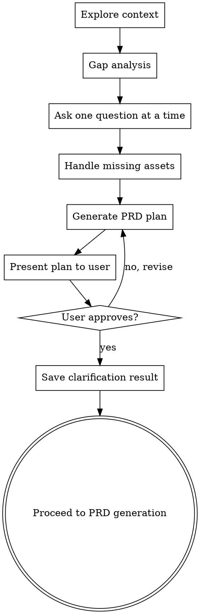

# Clarify Requirements

## Overview

在 PRD 生成前，确保所有感知数据已收集，且用户批准了内容方案。参考 superpowers brainstorming 的"逐步确认 → 方案审阅 → 用户批准"流程设计。

## HARD GATE

在以下条件全部满足前，**禁止调用 prd-gen 或任何 design 层 skill**：

1. 信息差距分析完成
2. 每个缺失项已逐一向用户确认（一次一个问题）
3. PRD 内容方案已呈现给用户
4. 用户已明确批准方案

## Anti-Pattern: "信息够了，直接生成吧"

**禁止**。即使你认为信息已经足够，也必须呈现方案并获得用户批准。"简单"需求更容易因为遗漏关键信息而导致 PRD 返工。

## Process Flow



## Step-by-Step Process

### Step 1: Explore Context

检查 `context/` 目录中已有的感知数据：

- `context/market-analysis.json` — 市场情报
- `context/competitive-analysis/*.json` — 竞品分析
- `context/user-research.json` — 用户研究
- `context/positioning.md` — 产品定位
- `context/prioritization.json` — 优先级排序

记录已有数据，避免重复收集。

### Step 2: Scenario Detection

使用 `AskUserQuestion` 确定需求场景：

**Q: 请选择需求场景**

| Option | Description |
|:-------|-------------|
| **迭代更新** | 基于现有功能进行迭代优化 |
| **新功能** | 在现有产品上添加新模块 |
| **0-1 新产品** | 从零开始规划全新产品 |

### Step 3: Gap Analysis

根据场景类型，对比用户已提供的信息与 `context-requirements`：

| 场景 | 必需字段 | 检查项 |
|:-----|:---------|:-------|
| **迭代更新** | current_feature_desc, ui_state, iteration_goal | 是否提供了当前功能描述？是否有 UI 截图/HTML/链接？是否明确了迭代目标？ |
| **新功能** | product_architecture, design_specs, entry_point | 是否描述了产品整体架构？是否有设计规范？是否说明了入口位置？ |
| **0-1 新产品** | background, constraints, reference_products | 是否说明了产品背景与目标用户？是否有资源约束？是否提供了参考产品？ |

**逐条列出缺失项**，准备下一步逐一确认。

### Step 4: Ask One Question At A Time

**核心规则：每条缺失信息单独提问，绝不一次性抛出多个问题。**

对每个缺失项，使用 `AskUserQuestion` 提问，优先使用多选格式：

**示例问题模板**：

| 缺失项 | 提问方式 |
|:-------|:---------|
| 缺少 UI 截图 | "当前功能的界面状态，你如何提供？" → A. 已有截图 B. 有 HTML 文件 C. 有在线链接 D. 暂无，先跳过 |
| 缺少竞品列表 | "需要分析哪些竞品？" → multi-select + "其他"选项 |
| 缺少目标用户 | "目标用户是？" → A. 已定义用户画像 B. 我口述你来整理 C. 需要先做用户研究 |
| 缺少参考产品 | "有参考产品吗？" → A. 有，我来说 B. 你帮我搜索行业标杆 C. 不需要参考 |

**处理用户说"稍后提供"的情况**：
- 记录哪些项是 pending 状态
- 在 PRD 方案中将这些项标记为 `[待补充]`
- 不阻塞流程，但明确标注缺失

### Step 5: Generate PRD Plan

基于已收集的信息，生成 PRD 内容方案：

```markdown
## PRD 内容方案

### 场景确认
- **场景类型**: 迭代更新 / 新功能 / 0-1 新产品
- **核心需求**: [一句话概括]

### 已收集信息
- [列出用户已提供的所有信息]

### 待补充项
- [列出 pending 项，标注 [待补充]]

### 预计生成的 PRD 章节
| 章节 | 内容概要 | 依赖 |
|:-----|:---------|:-----|
| 第0章 行业对标 | 将研究 X 个标杆产品 | 需用户提供参考产品 |
| 第1章 项目概述 | 基于用户描述展开 | 已完成 |
| 第2章 业务分析 | 目标用户 X，痛点 Y | [待补充] 用户画像 |
| 第3章 功能需求 | [列出从用户需求中识别的关键功能] | 已完成 |
| 第4章 非功能性需求 | 行业标准要求 | 自动生成 |
| 第5章 用户体验流程 | 基于功能推导 | 需 UI 截图补充 |
| 第6章 项目风险 | 基于功能复杂度 | 自动生成 |
| 第7章 合规建议 | 基于数据类型 | 自动生成 |
| 第8章 原型设计 | [待确认是否生成] | - |
| 第9章 成功指标 | 基于目标推导 | 自动生成 |

### 关键决策点
- [列出需要用户在 PRD 生成前确认的关键决策]
```

### Step 6: User Approval

使用 `AskUserQuestion` 让用户审阅方案：

**Q: 请审阅 PRD 内容方案**

| Option | Description |
|:-------|:------------|
| **确认，按此方案生成 PRD** | 进入 PRD 生成流程 |
| **需要调整方案** | 回到 Step 5 修改方案 |
| **我有更多信息要补充** | 回到 Step 4 补充信息，重新生成方案 |
| **先回到感知阶段** | 调用 competitive-analysis / user-research 等 skill 补充感知数据 |

### Step 7: Save Clarification Result

将澄清结果保存到 `context/clarification-result.json`：

```json
{
  "scenario": "iteration|new_feature|new_product",
  "collected_info": {
    "field1": "value1",
    "field2": "value2"
  },
  "pending_items": [
    {"field": "ui_state", "reason": "用户稍后提供截图"}
  ],
  "prd_plan": {
    "chapters_planned": ["第0章", "第1章", "..."],
    "key_decisions": ["决策1", "决策2"],
    "user_approved": true,
    "approved_at": "ISO 8601"
  }
}
```

## Quality Standards

- 每个必需字段已确认或标记为 pending
- 至少一次 `AskUserQuestion` 用于场景确认
- PRD 内容方案包含 9 章概要 + 关键决策点
- 用户已明确批准方案
- 澄清结果已保存到 `context/clarification-result.json`

## Context Integration

**Reads:**
- `context/market-analysis.json` — 市场情报
- `context/competitive-analysis/*.json` — 竞品分析
- `context/user-research.json` — 用户研究
- `context/positioning.md` — 产品定位

**Writes:**
- `context/clarification-result.json` — 需求澄清结果

**Output To:**
- `prd-gen` — 需求澄清作为 PRD 生成输入
- `competitive-analysis` — 如需补充竞品分析
- `user-research` — 如需补充用户研究
- `market-intelligence` — 如需补充市场情报

## Example Usage

```
User: "小鹅通有个打卡功能要加 AI 评价，需求是这样的..."
→ 检测到信息不完整（缺少 UI 截图、AI 助理现状、关联应用配置）
→ 逐步询问缺失项
→ 生成 PRD 内容方案
→ 用户确认后进入 PRD 生成

User: "帮我梳理一下这个需求还缺什么信息"
→ 直接调用 clarify-requirements
→ 系统性地识别和确认缺失信息
```
